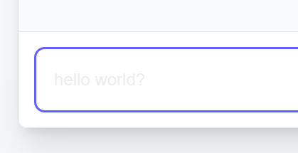

# Critique du projet

## Setup

Le script NPM `seed` n'est pas compatible avec Windows/PowerShell.

```bash
SyntaxError: Unexpected token ''', "'{module:CommonJS}'" is not valid JSON
```

Je me suis donc permis de rajouter et documenter les scripts `seed:windows` pour que le projet fonctionne sur Windows.

```diff
- "seed": "ts-node --compiler-options '{\"module\":\"CommonJS\"}' prisma/seed.ts"
+ "seed": "ts-node --compiler-options '{\"module\":\"CommonJS\"}' prisma/seed.ts",
+ "seed:windows": "ts-node --compiler-options \"{\\\"module\\\":\\\"CommonJS\\\"}\" prisma/seed.ts"
```

Le script `prisma.seed` nécessiterait quant à lui un peu plus de travail pour fonctionner sur toutes les plateformes. Pour le moment, je me suis juste contenté de dédupliquer le contenu du script qui était le même que `scripts.seed`.

## Format

Une configuration Prettier ne serait pas de trop, notamment pour éviter les conflits de formatage entre les différents contributeurs et projets d'un même workspace.

## Code

Le code est relativement bien documenté et fait usage de JSDoc, bien que l'on ait plus l'habitude de voir des commentaires en anglais qu'en français dans de tels projets.

Dans la mesure où l'on parle d'un projet de chatbot minimaliste, dans lequel on ne trouvera que 3 composants simples qui ne dépassent pas les 150 lignes de code, il n'y a pas grand chose de préjudiciable à dire sur le code en lui-même. On pourrait noter que :

- (Backend) La récupération des messages inclue 2 appels à la base de données, alors que l'on pourrait simplement faire usage de `conversationId` en guise de clé étrangère et ne faire qu'une requête, et détecter et forward toute erreur au client.
- (Data) Dans ce projet on utilise des modèles Prisma faisant usage d'une convention de nommage en pascal case, alors que l'on recommandera généralement de nommer ses tables en snake case. Mais Prisma [permet un mapping](https://www.prisma.io/docs/orm/prisma-schema/data-model/models#mapping-model-names-to-tables-or-collections) entre les noms des modèles et les noms des tables via `@@map` par exemple.
- `Chatbot.tsx` présente un use-case classique où Tanstack Query serait utile tantôt pour :
  - la création d'une nouvelle conversation (`data`, `isLoading`, `error`) là où on pourrait utiliser `useQuery`
  - l'envoi d'un message (`mutate`, `isLoading`, `error`) là où on pourrait utiliser `useMutation`
  - Dans les deux cas, on pourrait utiliser des hooks custom pour gérer la logique de la conversation hors du composant principal
- (UX) Dans `Chatbot.tsx`, toute erreur n'est affichée seulement que dans la console, il faudrait l'afficher dans la UI.
- (UX) Dans `ChatInput.tsx`, le texte de l'input est difficilement lisible, notamment car la propriété `color` se voit appliquer une valeur `inherit` par le style par défaut de Tailwind.



- (UX) Il semble y avoir un début de travail pour le dark mode dans `globals.css`, mais la majeure partie des composants finaux appliquent soit une classe `bg-white` soit une classe gradient à-la `bg-gradient-to-br from-gray-50 to-gray-100` en guise de couleur de fond et une couleur de texte appropriée pour du light mode.

## Niveau

Bien que nous sommes sur un projet (à un stade) minimaliste, je pense que le code est d'une qualité intermédiaire ou plus. Les éventuelles améliorations que j'avais notées sont simples à réaliser et le code existant était relativement minimal pour le peu de fonctionnalités qu'il était censé implémenter.
