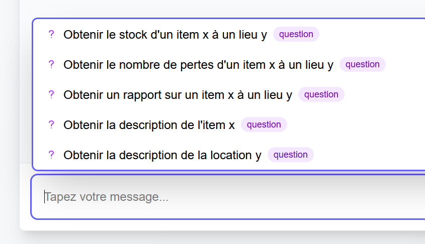
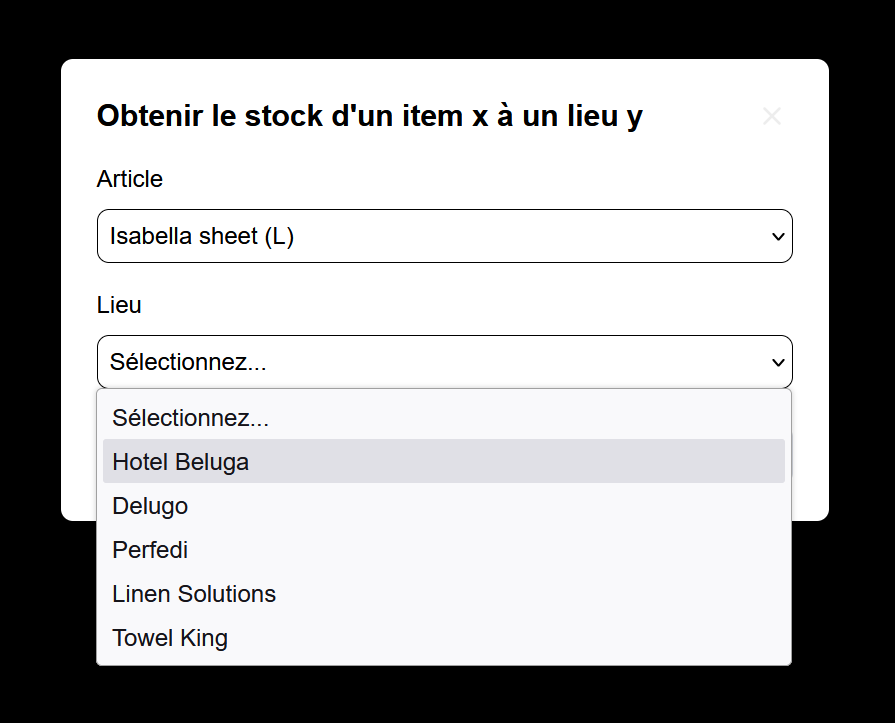
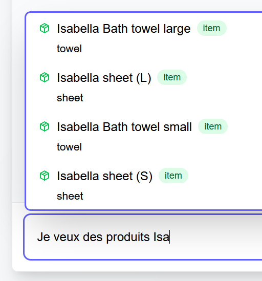
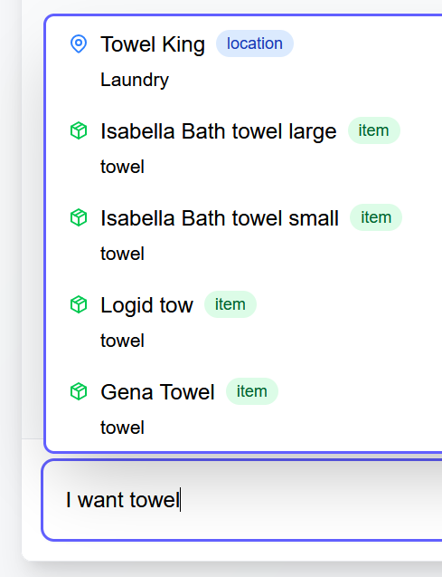
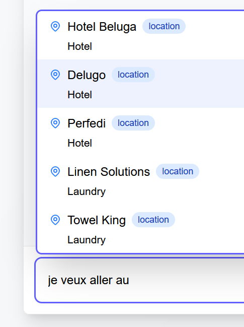

# Solution

Ceci est ma solution pour la partie 2 du test technique.

## Idée

Je voulais conserver l'interface de chatbot minimaliste tout en lui intégrant les suggestions de questions et mots clés, donc je suis parti sur une approche autour de l'autocomplétion afin de rapidement donner la main à l'utilisateur au moment d'écrire sa requête et lui suggérer soit des questions (si la chaîne de caractères est vide, donc vraisemblablement au début de l'interaction), soit des mots clés (si la chaîne de caractères contient des mots clés).

## Implémentation

Les suggestions sont récupérées depuis une nouvelle route API `/api/suggestions` qui retourne une liste de suggestions. La requête n'est certes pas optimale, on pourrait s'abstraire de requêter toutes les entrées de notre base de données, en utilisant divers techniques comme le debouncing lors de la saisie, et filtrer ne fonction de cette même saisie, voire même séparer les suggestions de questions et celles pour les mots clés mais pour l'exercice, je me suis concentré sur la partie fonctionnelle et montrer que l'on _peut_ répondre au besoin métier sans forcément effectuer de changements conséquents coté backend ou coté schéma Prisma.

Coté frontend, nous avons un nouveau hook `useSuggestions` qui gère la logique des suggestions et une petite modale pour afficher les suggestions en fonction de la saisie de l'utilisateur.

### Limitations et pistes d'amélioration

- La solution ne gère pas de fuzzy matching pour les suggestions de mots clés.

- La solution ne gère pas la traduction des suggestions, en l'occurrence, les suggestions "towel" que l'on trouve dans `items.csv` ne peuvent pas être suggérées si l'utilisateur tape "serviette".

- Les suggestions de questions, telles qu'elles sont listées en base de données ne permettent pas vraiment de faire du templating (la lettre `y` pourrait ne pas être une variable), on pourrait envisager d'ajouter un champ `template` dans les entrées de la table `Option` dans lequel on pourrait avoir des valeurs type `I want the stock of {object} at {location}`. Dans l'exercice, j'ai composé les templates de manière statique.

```diff
// schema.prisma
model Option {
  id          String @id @default(uuid())
  name        String @unique
  description String
+  template    String?
}
```

- Créer une route API uniquement pour les options de questions, et récupérer les localisations et items pour composer la question plutot que de les proposer en guise de suggestions => On séparerait les requêtes de catégories d'entrées.

## Fonctionnement

Lorsque l'on focus sur l'input, les suggestions de questions sont affichées.



Choisir une question permet de composer sa question et de remplacer le texte de l'input par la question complète.



Lorsque l'on tape du texte, les suggestions de mots clés sont affichées.



On peut mélanger divers thématiques de suggestions.



Une idée des plus folles pourrait même tenter d'anticiper certaines suggestions de localisations si certains mots sont utilisés comme "à" ou "au" ou "at the" ou "à la".


